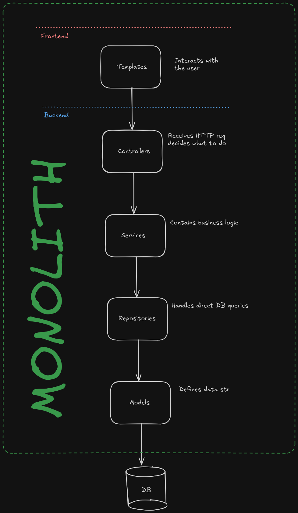

# System report

This is the system report of this monolith as the guide asked for.

## Fullname:

Juan David Loaiza Reyes

### Graphical representation of the system

### System properties

1. Modularity:
    * The system its not in only one file, its divided in modules, each one with only one responsability.
    * The logic of the DB its separated from the HTTP handling as an example.
2. Portability:
    * The system can run in any OS without changing the code.
    * For this is used Docker.
3. Maintanaibility
    * Its easy to fix or modify the system, this is for the layered pattern, if i need to change how data its saved, the user wont notice it. 
4. Interoperability
    * The python app is able to exchange data with a completely different system (DB)
5. Coupling
    * The layers interact through defined functions. The Controller doesn't know how the Repository saves data; it just calls a function.
